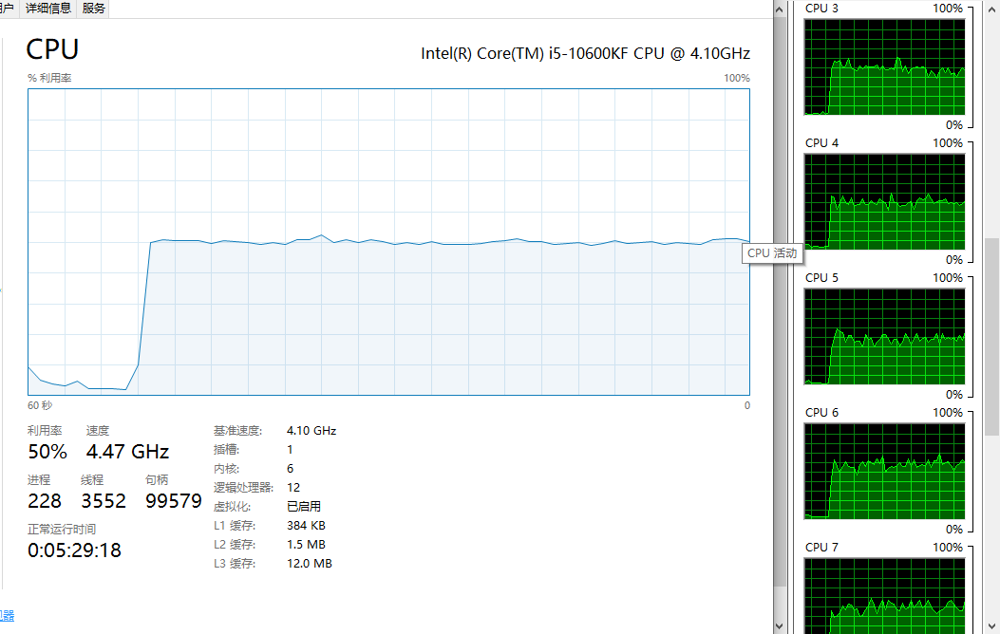

## CPU 维持 50% 说明
根据cpu的 Ghz来计算大概需要多少指令才能到达占满cpu。 

我的是4.1GHz ,6核12线程。

4.1e9 * 2 / 5 近似值 可以尝试。

可以大概猜测一个数，如果CPU高了，就减少一些，如果低了 你就增加。

我跑出来的效果如下：

基本维持在50%左右。

如果你们的机器跑我的代码，应该也会维持在一个值上面，但是一般都不会是50%。
而且机器上跑着其他的程序，也会影响cpu的使用率。